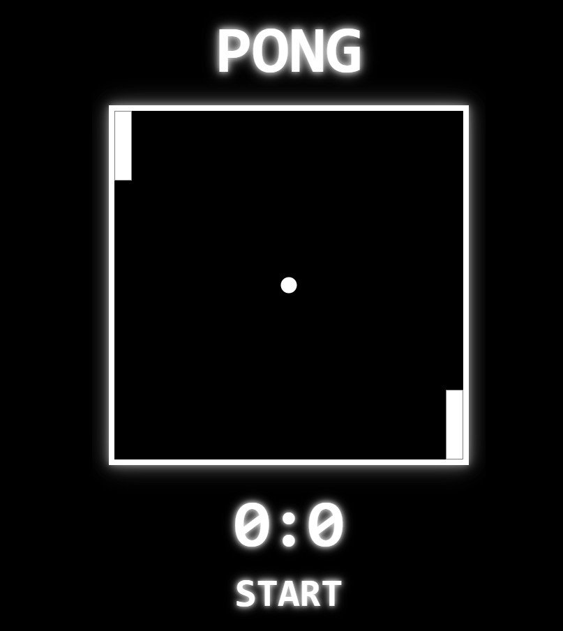

# PONG Game

## Project Summary

PONG is a classic arcade-style game recreated with modern web technologies including HTML5, CSS3, and vanilla JavaScript. This fully responsive, interactive browser-based application features smooth animations, real-time player controls, dynamic scoring, and both keyboard and mobile touch support. Designed for fun and simplicity, this implementation preserves the nostalgic experience while enhancing accessibility and responsiveness for today’s devices.

## Table of Contents

- [Mock-Up](#mock-up)
- [Instructions](#instructions)
- [Key Features](#key-features)
- [Deployed Application](#deployed-application)

## Mock-Up

The following image shows the web application's appearance and functionality:

## Instructions

To play the game:

1. Clone or download the repository files.

2. Open index.html in any modern web browser.

3. Press any key or click the canvas area to start.

4. Use the following controls to play:

- Player 1 (Left Paddle): W (up) and S (down)

- Player 2 (Right Paddle): ↑ (up arrow) and ↓ (down arrow)

- On mobile: tap the top or bottom half of the screen to move Player 1’s paddle

5. The game resets after each goal and keeps track of scores.

6. Click the RESTART button to reset the entire game.

## Key Features

**Responsive Canvas:** Automatically scales to fit desktop and mobile devices.

**Keyboard & Touch Controls:** Supports both keyboard input and basic mobile touch interaction for cross-platform accessibility.

**Real-Time Gameplay:** Smooth animation loop using requestAnimationFrame ensures seamless paddle and ball movement.

**Score Tracking:** Dynamic score display updates in real time as players score goals.

**Minimalist Design:** Clean, retro-themed UI with focus on gameplay and performance.

**Restart Functionality:** Restart the game at any time without reloading the page.

## Deployed Application

[PONG Game](https://gilmerperez.github.io/pong-game/)
